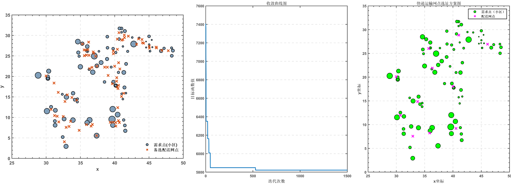

# Transport-Network-Selection-with-Firefly-Algorithm

## 项目简介

该项目展示了萤火虫算法（Firefly Algorithm, FA）在解决快递运输网点选址问题中的应用。通过使用萤火虫算法对选址问题进行优化，目的是在满足各个需求点货物需求的前提下，选取最优的配送网点组合，使得总运输成本最小。



## 主要内容

1. **萤火虫算法简介**
   - 萤火虫算法是一种群体智能优化算法，模拟萤火虫之间通过亮度吸引彼此的行为。其目标是通过个体间的相互吸引与移动，逐步优化求解空间，从而得到全局最优解。
   
2. **快递网点选址问题**
   - 问题描述：给定若干需求点及备选网点，目标是从备选网点中选择指定数量的网点，为各需求点提供货物配送，并使得需求点与配送网点间的距离与货物需求量乘积之和最小。
   - 获取备选网点：使用聚类算法生成备选网点
   - 数学模型：基于需求量、距离、以及 0-1 变量构建优化目标函数。

3. **算法实现**
   - 为适应离散型选址问题，将原连续型萤火虫算法进行离散化处理，通过四舍五入的方法将连续变量转换为离散变量，并进行重复编号处理。
   - 为避免算法陷入局部最优，加入最小吸引力与全局导向策略，提升算法性能。

4. **改进与参数调优**
   - 改进萤火虫算法的移动机制，加入全局导向性策略，使得个体不仅仅受周围个体的影响，还考虑全局最优解。
   - 自适应随机步长机制：步长较大时全局搜索能力较强，步长较小时收敛性更好，适应不同优化阶段。

## 项目结构

- `data/`: 需求信息
- `docs/`: 相关文档
- `src/`: 源代码
  - `Attraction.m`: 计算萤火虫个体之间的吸引度，吸引度由亮度差异和距离决定。
  - `Brightness.m`: 计算萤火虫个体的亮度，亮度表示解的好坏，与目标函数值相关。
  - `Distance.m`: 计算两只萤火虫个体之间的欧氏距离，用于决定萤火虫间的吸引力和移动方向。
  - `FA_Solve.m`: 萤火虫算法的核心求解过程，包括初始化、萤火虫移动、吸引度计算和解的更新。
  - `FA_Solve_Main.m`: 项目主入口，运行该函数可执行整个萤火虫算法流程。
  - `GetBackupPoints.m`: 获取可供选择的配送网点，作为求解问题的输入数据。
  - `InitFireflies.m`: 初始化萤火虫种群，生成初始解。
  - `MoveFireflies.m`: 根据吸引度和距离，更新萤火虫的位置信息，实现解的迭代更新。
  - `objFun.m`: 目标函数，计算当前解的运输成本，作为优化的评价标准。
  - `replace.m`: 当萤火虫个体位置无效时，进行解的替换和修正操作。

## 使用方法

1. **安装与运行**
   - 克隆此仓库：
     ```bash
     git clone https://github.com/fengwm64/Transport-Network-Selection-with-Firefly-Algorithm.git
     ```
   - 在 MATLAB 中打开 `src` 文件夹，运行主文件 `FA_Solve_Main.m`。

2. **参数设置**
   - 种群规模、最大迭代次数、吸引度、步长等算法参数可以在 `FA_Solve_Main.m` 中进行调整。


## 参考文献

[1] Li J, Wei X, Li B, et al. A survey on firefly algorithms[J]. Neurocomputing, 2022, 500: 662-678.  
[2] 毛艺楠. 萤火虫算法的改进及其在物流中心选址中的应用[D]. 河南大学, 2019.  
[3] 陈庆斌, 杨耿煌, 耿丽清等. 基于改进麻雀搜索算法的配送中心选址研究[J]. 天津职业技术师范大学学报, 2023, 33(02): 14-19. DOI: 10.19573/j.issn2095-0926.202302003.  
[4] 赵世安, 屈迟文. 改进的布谷鸟算法求解物流配送中心选址问题[J]. 数学的实践与认识, 2017, 47(03): 206-213.  
[5] 张鑫, 李柯宜, 赵越. 基于遗传算法的景区公共设施和配送中心选址——以南京市为例[J]. 现代商贸工业, 2023, 44(19): 44-46. DOI: 10.19311/j.cnki.1672-3198.2023.19.015.
